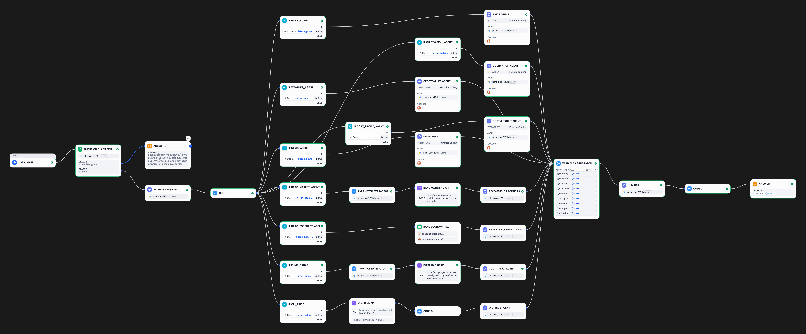

# kumaru

# 🤖 KUMARU Test 4: Smart Agri-Assistant
**Description:** An advanced multi-agent conversational AI designed to provide comprehensive agricultural insights, from market prices and cultivation techniques to fuel status and economic forecasts.

---

## 🇹🇭 ภาษาไทย (Thai)

### 📋 ภาพรวมระบบ
KUMARU คือระบบผู้ช่วยอัจฉริยะที่ใช้โครงสร้างแบบ **Intent-Based Routing** โดยจะวิเคราะห์คำถามของผู้ใช้ก่อน แล้วจึงส่งงานต่อไปยัง "Agent" เฉพาะทางที่เหมาะสม เพื่อรวบรวมข้อมูลที่แม่นยำที่สุดก่อนจะสรุปผลด้วยบุคลิกที่สดใสและเป็นกันเอง

### ⚙️ ขั้นตอนการทำงาน (Workflow)
1.  **Question Classification:** คัดกรองคำถามเบื้องต้นว่าเกี่ยวข้องกับการเกษตรหรือไม่
2.  **Intent Analysis:** ใช้ LLM วิเคราะห์ความต้องการของผู้ใช้และตัดสินใจว่าจะเรียกใช้ Agent ตัวไหนบ้าง (สามารถเรียกใช้พร้อมกันหลายตัวได้)
3.  **Data Retrieval (Multi-Agents):** Agent ที่ได้รับมอบหมายจะออกไปหาข้อมูลผ่านเครื่องมือต่างๆ เช่น DuckDuckGo Search, ข้อมูลจากธนาคาร (BAAC RAG), หรือ API ราคาน้ำมัน
4.  **Variable Aggregator:** รวบรวมคำตอบจากทุก Agent เข้าด้วยกัน
5.  **Final Summarization (KUMARU):** LLM หลัก (Persona: หมี Kumaru) จะนำข้อมูลทั้งหมดมาเรียบเรียงเป็นภาษาที่เข้าใจง่าย สุภาพ และสนุกสนาน
6.  **Formatting:** ทำความสะอาดข้อมูล (Clean markdown) ก่อนแสดงผลลัพธ์สุดท้าย

### 🛠️ รายละเอียด Agent เฉพาะทาง
| Agent | หน้าที่หลัก | แหล่งข้อมูล |
| :--- | :--- | :--- |
| **Price Agent** | รายงานราคาสินค้าเกษตรวันนี้ | DuckDuckGo / เว็บไซต์รัฐบาล |
| **Cultivation Agent** | วิธีปลูก, การดูแล, โรคพืช และศัตรูพืช | กรมวิชาการเกษตร / มหาวิทยาลัย |
| **Geo Weather** | พยากรณ์อากาศและวิเคราะห์ความเหมาะสมของดิน | กรมอุตุนิยมวิทยา / GISTDA |
| **Cost & Profit** | คำนวณต้นทุน กำไร และจุดคุ้มทุน (ROI) | ข้อมูลเศรษฐกิจการเกษตร |
| **BAAC Economy** | วิเคราะห์เศรษฐกิจและคาดการณ์ราคาปี 68-69 | Knowledge Base (RAG) |
| **Pump Radar** | เช็คสถานการณ์น้ำมันในแต่ละจังหวัด | External API |
| **Oil Price** | อัปเดตราคาน้ำมันบางจาก (วันนี้/พรุ่งนี้) | Bangchak API |

---

## 🇺🇸 English

### 📋 System Overview
KUMARU is an advanced AI assistant utilizing **Intent-Based Routing**. The system analyzes user queries to trigger specialized agents, ensuring precise data collection across various agricultural domains before synthesizing a friendly and helpful response.

### ⚙️ Workflow Explained
1.  **Question Classification:** Initial filter to ensure the query is relevant and safe.
2.  **Intent Analysis:** An LLM determines the user's intent and maps it to one or more specialized agents.
3.  **Data Retrieval (Multi-Agents):** Assigned agents fetch real-time data using tools like DuckDuckGo Search, specialized RAG (Knowledge Retrieval), or third-party APIs (Fuel/Oil prices).
4.  **Variable Aggregator:** Collects outputs from all active agents into a single context.
5.  **Final Summarization (KUMARU):** The main LLM (Persona: Kumaru the bear) synthesizes the data into a plain-text, easy-to-read, and energetic response.
6.  **Formatting:** A Python script cleans special characters and markdown for a consistent UI experience.

## 🖼️ Workflow Diagram

### 🛠️ Specialized Agents
| Agent | Primary Responsibility | Data Source |
| :--- | :--- | :--- |
| **Price Agent** | Current market prices and trends | Web Search (DuckDuckGo) |
| **Cultivation Agent** | Farming techniques, livestock, and pest control | Agricultural Dept. Data |
| **Geo Weather** | Weather forecasts and soil suitability | Meteorological/GISTDA Data |
| **Cost & Profit** | ROI, cost breakdown, and financial estimation | Economic analysis models |
| **BAAC Economy** | 2025-2026 economic & price forecasting | BAAC RAG (Knowledge Base) |
| **Pump Radar** | Fuel availability and status by province | Pump Radar API |
| **Oil Price** | Real-time oil price updates | Bangchak API |

---

[thaipumpradar](https://www.thaipumpradar.com/)
[text](https://oil-price.bangchak.co.th/ApiOilPrice2)

### 🚀 Technical Stack
* **Platform:** Dify (Advanced Chatflow)
* **Core Model:** vLLM (ptm-oss-120b)
* **Logic:** Python 3 (Formatting & Intent Logic)
* **Search:** DuckDuckGo Plugin
* **Data:** RAG (Knowledge Retrieval) & REST APIs

---

